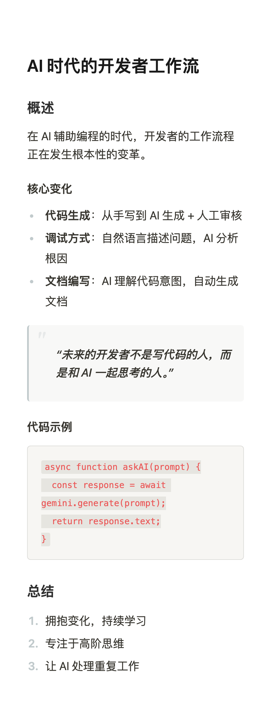
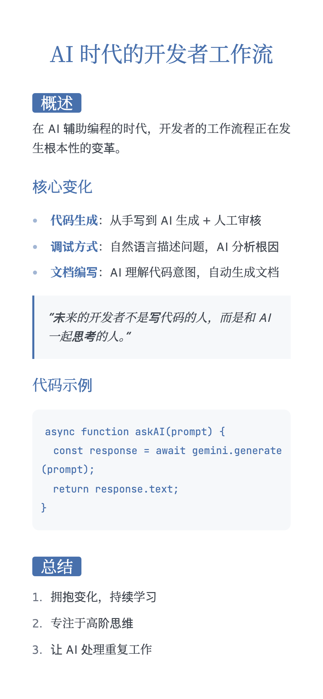
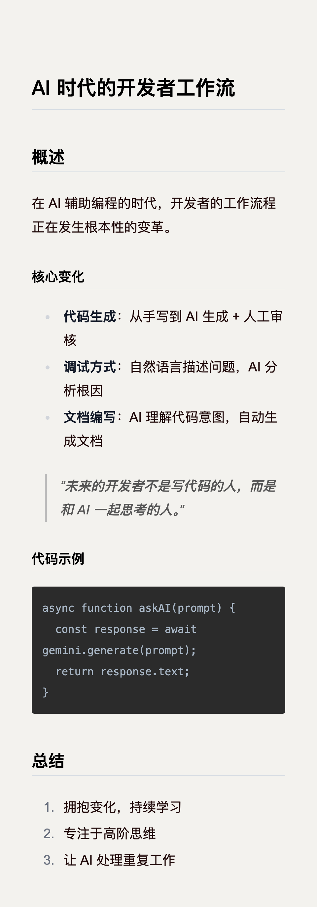
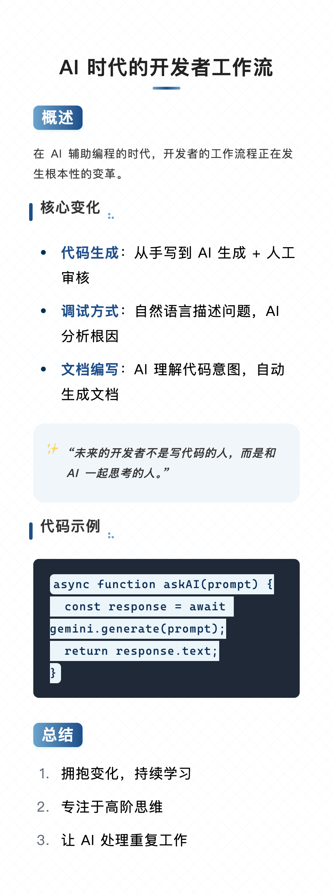
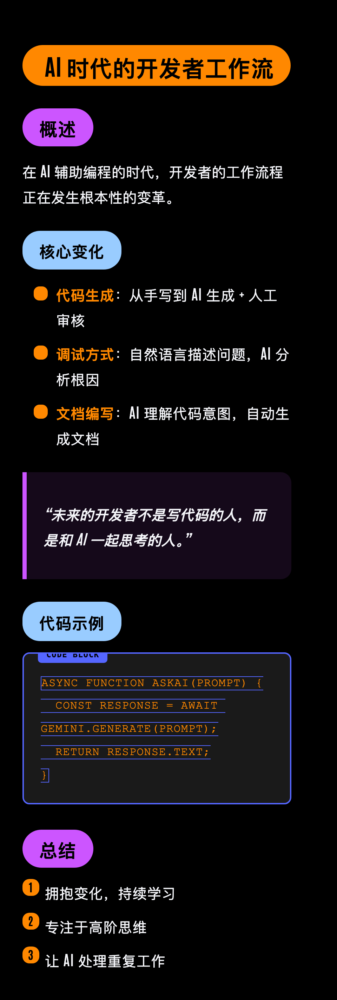
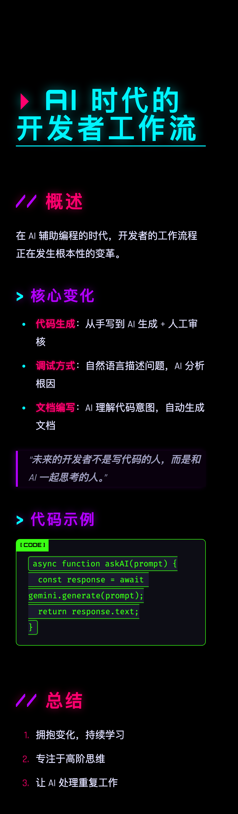
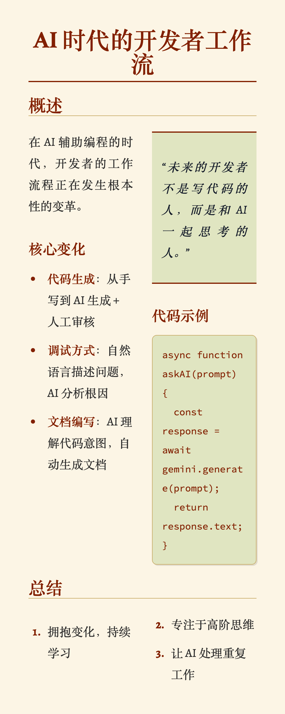

# md2poster-skill

> 🎨 将 Markdown 一键转换为精美图片 | Convert Markdown to beautiful poster images

一个专为 **Gemini CLI** 设计的 Skill，也可独立使用。支持 7 种精心设计的主题，让你的文章、笔记、教程瞬间变成可分享的精美图片。


## ✨ 主题展示

<p align="center">
  
  
  
  
</p>
<p align="center">
  
  
  
</p>

|        主题         | 风格                 | 适用场景           |
| :-----------------: | :------------------- | :----------------- |
|     **notion**      | 简洁、干净、无衬线   | 笔记、文档、日报   |
|      **lapis**      | 学术蓝白、优雅       | 论文、深度分析     |
|     **bronya**      | IDEA 代码风格、温暖  | 开发日志、教程     |
|  **lcars / neon**   | 星际迷航科幻、高对比 | 科技新闻、极客内容 |
|    **cyberpunk**    | 赛博朋克、霓虹       | 游戏、加密、安全   |
|    **torillic**     | 羊皮纸、经典、双栏   | 历史、文学、故事   |
| **phycat-prussian** | 普鲁士蓝、专业       | 商务报告、公告     |

## 🚀 快速开始

### 安装依赖

```bash
cd md2poster-skill
npm install
```

### 使用方法

```bash
node render.js <input.md> [output.png] [theme] [size]
```

**参数说明:**
- `input.md` - Markdown 文件路径（必填）
- `output.png` - 输出图片路径（可选，默认 `~/Downloads/markout/<filename>.png`）
- `theme` - 主题名称（可选，默认 `phycat-prussian`）
- `size` - 尺寸 `pc`（宽）或 `mobile`（窄，默认）

### 示例

```bash
# 使用 Notion 简洁主题
node render.js my-notes.md output.png notion mobile

# 使用 LCARS 科幻主题
node render.js tech-news.md output.png lcars pc

# 使用赛博朋克主题
node render.js crypto-update.md output.png cyberpunk mobile
```

## 🤖 作为 Gemini CLI Skill 使用

将此目录放入 `~/.agent/skills/` 即可。Gemini CLI 会自动根据内容选择最合适的主题！

```
~/.agent/skills/
└── md2poster-skill/
    ├── SKILL.md
    ├── render.js
    └── ...
```

使用时只需告诉 Gemini：

> "把这段内容转成图片"

AI 会自动分析内容语气，选择匹配的主题并生成图片。

## 📦 技术栈

- **Vite** + **React** - 快速开发服务器
- **markdown-to-poster** - Markdown 渲染核心
- **Puppeteer** - 无头浏览器截图
- **TailwindCSS** - 样式系统

## 🎨 自定义主题

在 `vite-project/src/App.tsx` 中可以轻松添加新主题：

1. 定义主题颜色到 `themeColors` 对象
2. 创建对应的 CSS 变量和样式
3. 在 `SKILL.md` 中更新主题列表

欢迎 PR 贡献新主题！

## 📄 License

MIT © [badDevBuild](https://github.com/badDevBuild)

---

**喜欢这个项目？给个 ⭐ 吧！**
